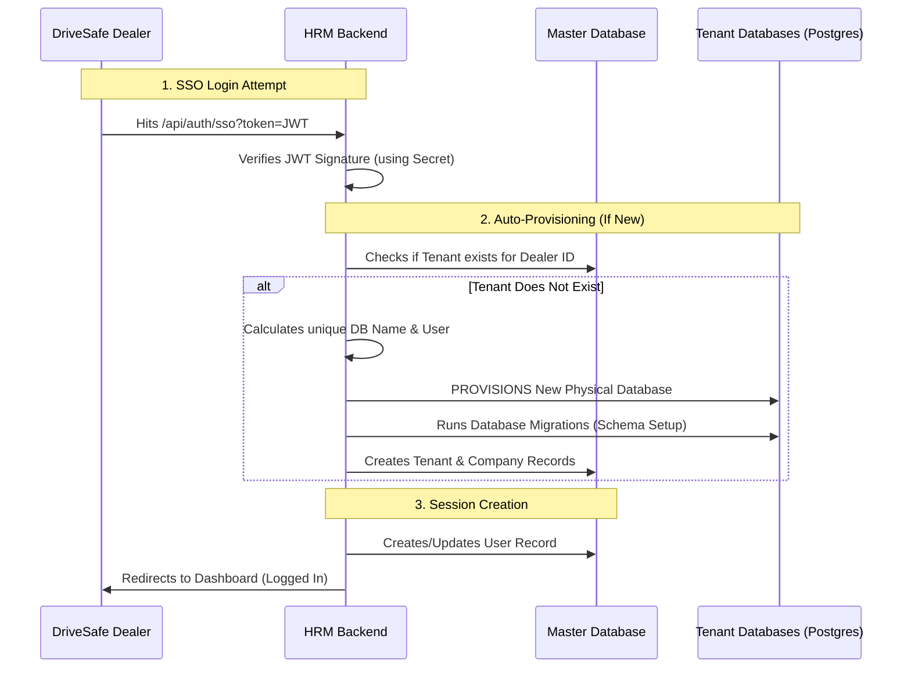

# DriveSafe HRM Integration - Admin Overview

This document explains how the integration works internally and what you need to configure.

## 1. System Architecture Flow

The integration bridges DriveSafe dealers with your Multi-Tenant HRM. It is designed to be fully automated ("Just-In-Time" provisioning).



### Key Concepts
- **JIT Provisioning**: You don't need to manually create companies for dealers. When a new dealer clicks the link in DriveSafe, the system automatically creates a dedicated database for them (via `CompanyService`).
- **Isolation**: Every dealer gets their own physical PostgreSQL database, ensuring strict data privacy.
- **SSO Only**: Dealer users log in via DriveSafe. They do not have local passwords.

---

## 2. Environment Configuration

To enable this, you must add the following variables to your production `.env` file.

### Secrets (Must match what you give DriveSafe)
These are security keys. Generate random strings for these.
```bash
# Verify DriveSafe's SSO tokens
DRIVESAFE_SSO_SECRET=generate-a-long-random-secret-here

# Verify DriveSafe's API requests
DRIVESAFE_HMAC_SECRET=generate-another-long-random-secret-here
```

### Configuration
```bash
# Expected audience in their JWT (default: hmac)
DRIVESAFE_SSO_AUDIENCE=hrm

# Redirect URL after successful login
SSO_REDIRECT_URL=https://hrm.your-domain.com/dashboard

# Redirect URL if SSO fails (optional)
SSO_ERROR_URL=https://hrm.your-domain.com/auth/error
```

---

## 3. Managing Integration
You can use the new Integration APIs to manage this, but usually, it's automatic.
- **Deactivation**: If a dealer stops paying DriveSafe, DriveSafe can call the Deactivate API. This instantly locks the tenant and all its users in your system.
- **Manual Control**: You can still see these companies in your Super Admin panel. They appear as regular companies but with an extra "External ID" link.
